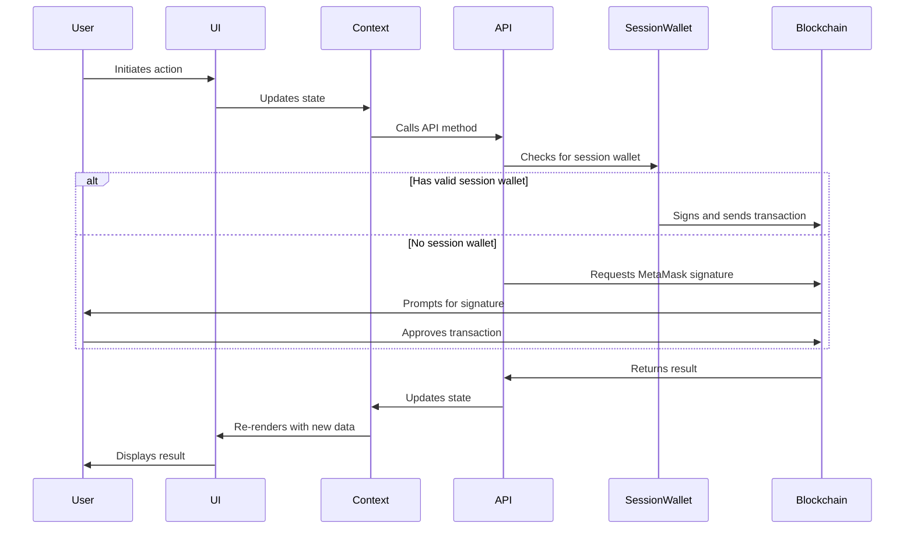

# Architecture Overview

## System Architecture

OpenChat is designed as a decentralized messaging application that operates exclusively on blockchain test networks. The system implements a microservice architecture pattern with clear separation of concerns, ensuring modularity and scalability.

### Key Components

1. **Frontend Application**
   - Next.js React application
   - Responsive design with Tailwind CSS
   - Client-side blockchain integration via ethers.js

2. **Smart Contracts**
   - DappChat.sol - Core messaging contract
   - OpenChatGroups.sol - Group chat functionality
   - Deployed on multiple testnets (Sepolia, Goerli, Mumbai)

3. **Blockchain Integration Layer**
   - Custom API wrappers
   - Session wallet management
   - Cross-network compatibility

4. **Security Layer**
   - Testnet restrictions
   - Session wallet implementation
   - Signature verification

## Data Flow

The system implements a unidirectional data flow pattern:

1. User interactions trigger state changes in React components
2. State changes propagate through the context provider system
3. Context providers interact with the blockchain via API layer
4. Smart contracts execute operations and emit events
5. Events are captured by the frontend and update the UI

### Communication Flow Diagram

## Network Architecture

OpenChat operates exclusively on testnet environments, with primary support for:

- Ethereum Sepolia (primary)
- Ethereum Goerli
- Polygon Mumbai
- BSC Testnet

The application implements network detection and automatic switching to ensure users remain on supported testnets. 